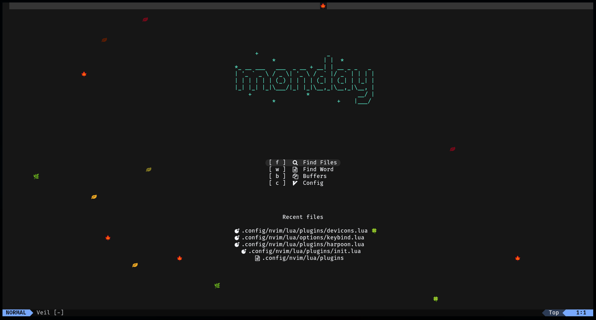
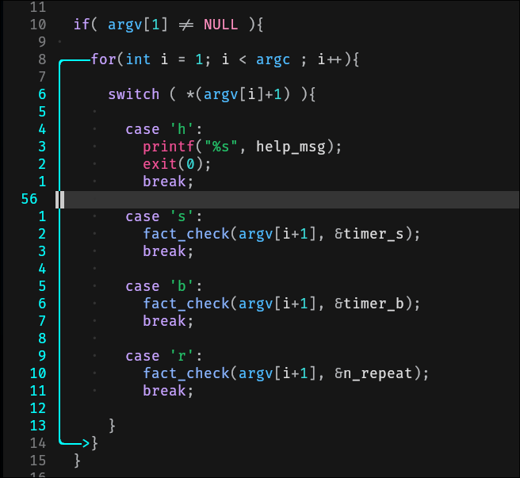
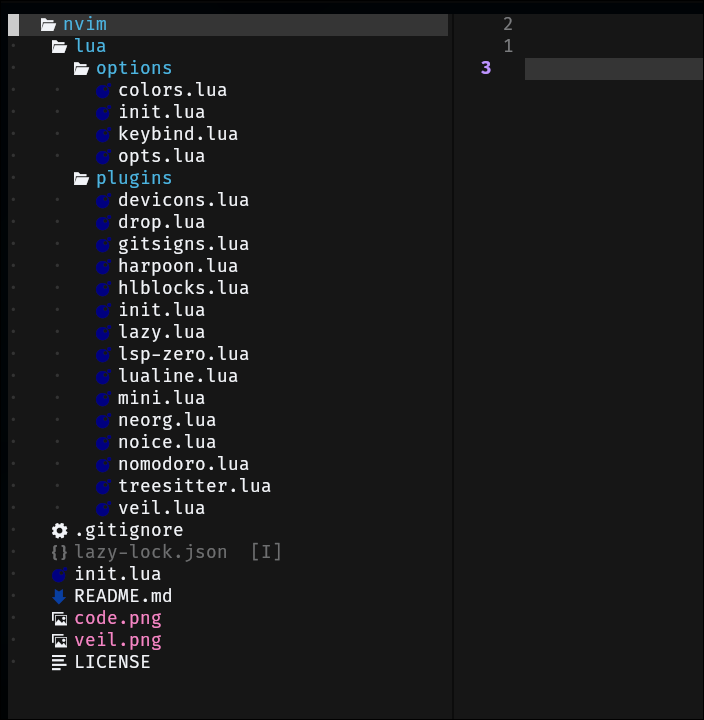
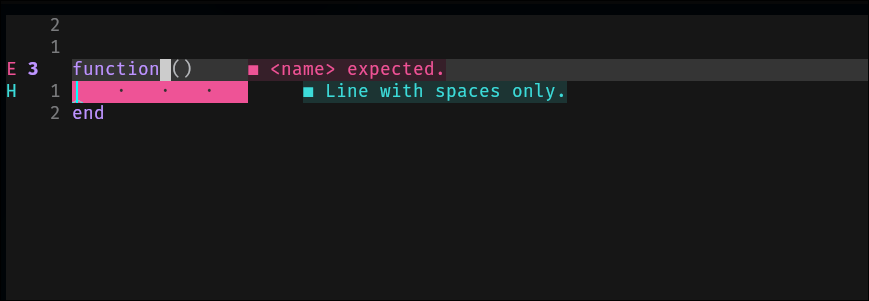
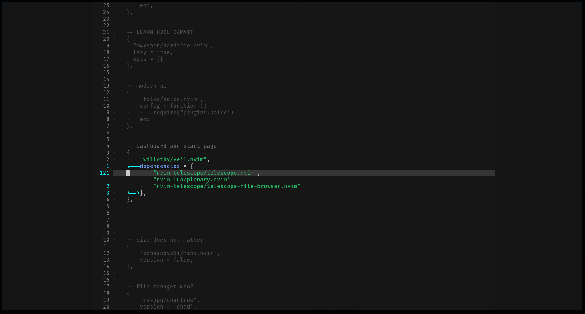
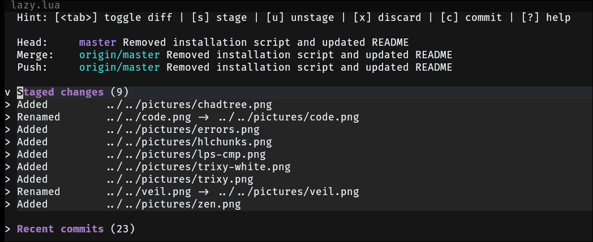

<p align="center">
  
</p>


# Trtixy is a begginer friendy distro of neovim, that aims to be powerfull while remaining minimal.


## Notable plugins and features include :
- `onedark` and `nightfox` colorschemes
- `zen-mode` with `twilight`
- new, modern ui by `nui` and `noice`
- improved camelCase navigation wit w, b, e etc
- `harpoon` for easier jumping between project files
- pomodoro timer using `nomodoro` ; when pomodoro timer runs out, break starts with `cellular-automation.nvim`
- git integration using `gitsigns` and `neogit`
- debugger interface with `nvim-dap-ui`
- `hlchunk.nvim` used for highlighting current scope
- `veil` as a dashboard and startpage
- `chadtree` for file tree view
- `lsp-zero` as a language server setup, simply briliant


# Installation
```
$ git clone https://gitlab.com/sumarac/trixy ~/.config/nvim/
nvim +"Lazy sync"
```
It should pull Lazy.nvim itself, and also all of the plugins. Run :Mason to install your Language Servers of choice.


# Screenshots

### Dashboard with screensaver falling leaves


### Highlighting current scope


### File tree


### Language Server



### Zen mode, with twilight


### Git integration


